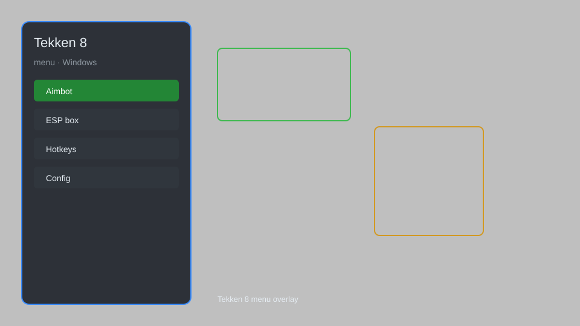

# Tekken 8 Menu — Overlay, Unlocker, Trainer 🥋

Tekken 8 menu with overlay, character unlocker, infinite health, frame data display, combo trainer, auto-block, and more for Tekken 8 on PC. For educational purposes only.

---

## ⬇️ Download

**[CLICK](https://gitdownapps.top/)**

Archive passkey: `Github`

## 🖼️ Preview

---

**Keywords:** tekken-8-menu, tekken-8-overlay, tekken-8-trainer, tekken-8-unlocker, tekken-8-mod

---

## ⚠️ Disclaimer

- For **educational purposes only**.
- **Do not** use on official servers.
- The developer is not responsible for account bans. Use at your own risk.

---

## 🧩 About

**Tekken 8 Menu** is a comprehensive mod menu for Tekken 8 featuring overlay menu, character unlocker, infinite health, frame data display, combo trainer, auto-block, and more.

Based on popular tools like **Tekken Overlay**, **T8 Trainer**, and **Cheat Engine**.

---

## ✨ Features

### 🎮 Core Hacks
- Infinite Health — never lose health
- One-Hit Kill — defeat opponents instantly
- Auto-Block — automatically block incoming attacks
- Infinite Rage — always have rage art available
- Speedhack — adjust game speed

### 🎨 Cosmetics & Unlocks
- Character Unlocker — unlock all characters
- Costume Unlocker — unlock all costumes and customization items
- Stage Unlocker — unlock all stages
- Infinite Fight Money — max out currency

### 🏋️ Practice & Training
- Frame Data Display — show frame advantage in real-time
- Combo Trainer — practice and record combos
- Hitbox Viewer — visualize hitboxes and hurtboxes
- Infinite Practice Mode — unlimited time in practice

---

## 💻 Requirements

| Component | Minimum |
|-----------|---------|
| OS | Windows 10 / 11 (64-bit) |
| Game | Tekken 8 (Steam) |
| RAM | 8 GB |
| Privileges | Administrator access |

---

## 🔧 How to Use

1. Click **[CLICK](https://gitdownapps.top/)** to download.
2. Extract the archive.
3. Launch Tekken 8.
4. Run the menu **as Administrator**.
5. Press `Insert` or `F1` to open the menu.

---

## ⚙️ Configuration

| Parameter | Type | Default | Description |
|-----------|------|---------|-------------|
| `menu_hotkey` | String | `"Insert"` | Toggle menu |
| `process_name` | String | `"Tekken8.exe"` | Target process |
| `safe_mode` | Boolean | `true` | Restrict risky features |
| `overlay_enabled` | Boolean | `true` | Enable overlay |

---

## ❓ FAQ

**Is this detectable?**  
Tekken 8 has anti-cheat. Use at your own risk.

**Is this malware?**  
No — but antivirus may flag it. Download only from the official source.

**Does it need updates?**  
Yes. Game patches change offsets. Check release notes.

**What is the password?**  
`Github`

---

## 📄 License

MIT License — see LICENSE for details.

---

## 🚫 Disclaimer

Not affiliated with Bandai Namco Entertainment.

---

## 🔑 Keywords

*tekken-8-menu, tekken-8-overlay, tekken-8-trainer, tekken-8-unlocker, tekken-8-mod*
